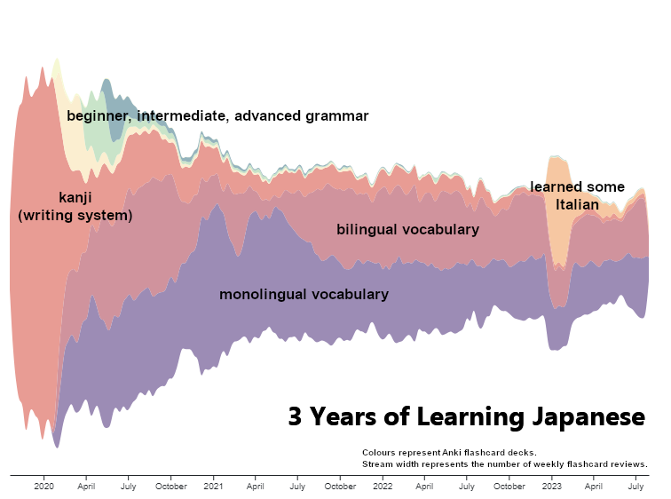

## 🙋‍♂️ Introducing Myself

Hello, I'm Rich, a data analyst with a background in software engineering and product management. 

This portolio page is where I track my personal development and showcase what I've been working on.

### 🌱 Portfolio Projects

#### [Social Network Customer Churn Analysis and Prediction](https://github.com/richhuwtaylor/fighting-churn)

A project demonstrating techniques for understanding and predicting customer churn for a simulated social network. By combining product usage analytics event data with customer subscription data, we can reveal which usage behaviours have the biggest impact on churn probability and predict the churn probability of individual accounts.

Cohort Analysis | Logistic Regression | Postgres | SQL

#### [AdventureWorks Business Intelligence Dashboard](https://github.com/richhuwtaylor/adventure-works)

A Microsoft Power BI business intelligence dashboard for AdventureWorks, a fictional global manufacturing company that produces cycling equipment and accessories. The data was derived from the [AdventureWorks sample databases](https://learn.microsoft.com/en-us/sql/samples/adventureworks-install-configure?view=sql-server-ver16&tabs=ssms) available from Microsoft.

Power BI | M Formula Language | Power Query | DAX

#### [Dessert or Not? - A PySpark Logistic Regression Pipeline](https://github.com/richhuwtaylor/dessert-or-not)

A data cleaning and logistic regression pipeline implemented in PySpark which examines which aspects of an Epicurious recipe are important in determining whether or not the recipe is for a dessert. The final `pyspark.ml` Pipeline uses custom-made Transformers and Estimators for missing value imputation and outlier capping.

PySpark ML | Logistic Regression | Data Cleaning

### 📖 Materials I've Found Helpful

Where appropriate, I include links to my own solutions to "end of chapter" exercises.

#### SQL

_[Anthony DeBarros - Practical SQL, 2nd Edition](https://nostarch.com/practical-sql-2nd-edition)_  
([my chapter solutions](https://github.com/richhuwtaylor/practical-sql))

#### Statistics

_[Thomas Haslwanter - An Introduction to Statistics with Python](https://link.springer.com/book/10.1007/978-3-030-97371-1)_ 
([my chapter solutions](https://github.com/richhuwtaylor/statsintro_python))

_[Maven Analytics - Statistics for Data Analysis](https://mavenanalytics.io/course/statistics-for-data-analysis)_ 
([my solutions and notes from mid-course projects](https://github.com/richhuwtaylor/statistics-for-data-analysis/tree/main))

#### Spark
_[Jonathan Rioux - Data Analysis with Python and PySpark](https://www.manning.com/books/data-analysis-with-python-and-pyspark)_ 
([my chapter solutions](https://github.com/richhuwtaylor/analysis-with-python-and-pyspark))

### 👋🏻 Connect with Me on [LinkedIn](https://www.linkedin.com/in/richhuwtaylor/)